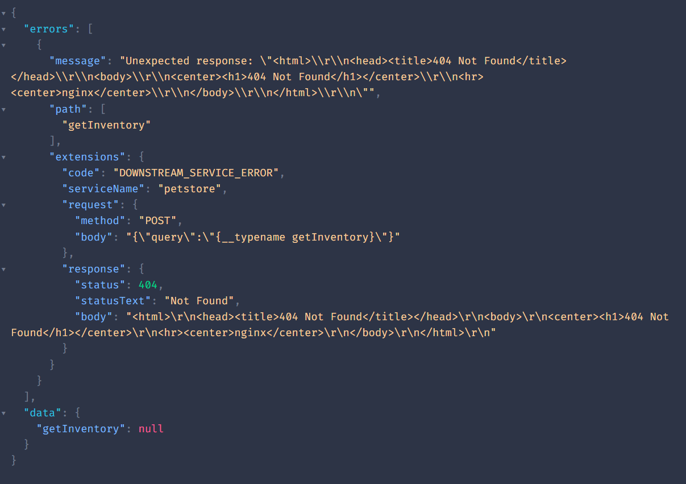

# Mesh + Hive gateway

Issue: Can't make requests to the OpenAPI service through the Hive gateway. GraphQL APIs work fine.

## Steps to reproduce

1. Install the dependencies
```bash
pnpm install
```

2. Create a Hive Federation project and get the Registry and CDN tokens from the `development` target.

3. Update the `gateway.config.ts` and `hive.json` files with the tokens and the supergraph endpoint.

4. Compose the remote subgraphs into files
```bash
npx mesh-compose --subgraph Countries -o countries.graphql
npx mesh-compose --subgraph Petstore -o petstore.graphql
```

5. Publish the composed subgraphs to the Hive Registry
```bash
pnpm hive schema:publish --service "petstore" --url "https://petstore.swagger.io/v2" petstore.graphql
pnpm hive schema:publish --service "countries" --url "https://countries.trevorblades.com" countries.graphql
```

6. Start the gateway - use supergraph Hive composed from subgraphs
```bash
pnpm start
```
> This reads the `gateway.config.ts` file and starts the gateway with the supergraph from the Hive CDN.

7. Go to localhost:4000/graphql and make a request to the Petstore service through the gateway
```graphql
# Request to Petstore (OpenAPI) - doesn't work
query {
  getInventory
}

# Request to Countries (GraphQL) - works
query {
  countries {
    capital
  }
}
```

8. Error :(

